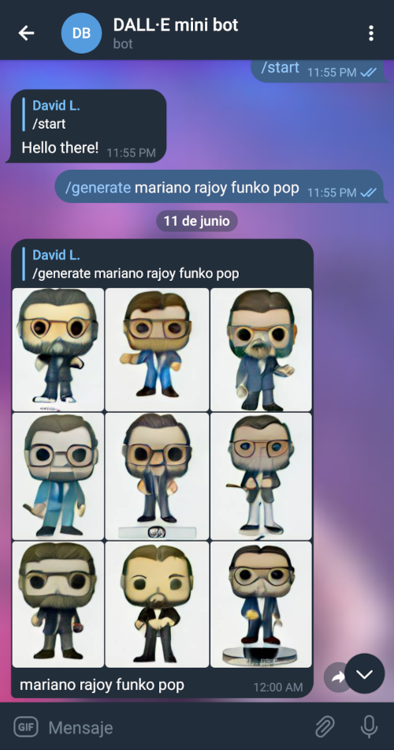

# DALL·E mini Telegram bot

A Telegram bot interface for DALL·E mini.
Request 9 AI-generated images from any prompt you give, directly from Telegram.

## Features

- Request from Telegram, return the 9 pictures result as an album
- Status report while the images are being generated (the bot sends a 'typing-like' status to the user, until all its requests are completed)
- If the server is too busy, keep retrying until success (or timeout)

The bot is deployed here: [https://telegram.me/dalle_mini_bot](https://telegram.me/dalle_mini_bot)

## Changelog

- v0.0.1
  - Initial release
  - Generate images from "Generate command", return as album
  - "Generate command" rate limited at chat level (concurrent requests limit)
  - "Generate command" sends a 'typing-like' status to the user, while the prompt/s requested are being generated
